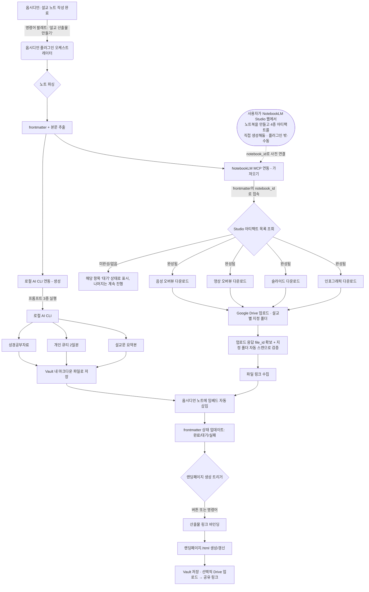

# 변경 이력

- **v0.4 (2026-07-09)**: 산출물 1~4번(인포그래픽·슬라이드·영상·음성)의 생성 방식을 근본적으로 변경. 기존에는 플러그인이 "생성" 버튼으로 NotebookLM에 소스를 업로드하고 4개 아티팩트 생성을 **트리거**했으나, 이제는 **사용자가 NotebookLM Studio에서 이미 만들어둔 노트북**을 전제로, 플러그인은 그 노트북에 이미 존재하는 완성된 아티팩트를 **가져오기(fetch)**만 한다. 생성 자체는 플러그인 밖(NotebookLM 웹 UI, 수동)에서 이루어진다. 이에 따라 "notebook 생성/소스 업로드/생성 트리거/폴링" 로직은 제거되고, "기존 notebook_id 연결 → Studio 아티팩트 목록 조회 → 완성분 다운로드"로 대체된다. Drive 업로드·임베드 방식(v0.3)은 그대로 유지.
- **v0.3 (2026-07-09)**: 산출물 1~4번 파이프라인의 "Drive 업로드 후 링크 확보" 단계를 명확화. 업로드 API 응답의 `file_id`만 신뢰하지 않고, 설교별 지정 Drive 폴더를 자동 스캔해 실제 반영 여부를 검증·보정하는 절차를 추가(3장, 5장 개정). 업로드 주체는 플러그인(Drive API 직접 업로드)이며, 로컬 동기화 폴더 방식은 채택하지 않음.
- **v0.2 (2026-07-08)**: `obsidian-embedder`, `reallygood-research` 분석을 반영한 최초 통합 설계.

# 개요

설교 노트 하나(옵시디언 vault 안의 마크다운 파일)를 소스로 삼아, 7가지 목회 산출물을 자동 생성·수집하고 옵시디언 노트 안에 다시 연결(임베드)하며, 마지막에는 이 7가지를 한 페이지에서 볼 수 있는 통합 랜딩페이지까지 만들어주는 파이프라인을 설계한다.

산출물 1~4번(인포그래픽·슬라이드·영상·음성)은 플러그인이 생성을 트리거하지 않는다. **사용자가 NotebookLM Studio에서 미리 만들어둔 노트북**에 이미 생성되어 있는 아티팩트를, 플러그인이 **NotebookLM MCP로 가져와(fetch)** **Google Drive**에 업로드하고, 파일 링크를 옵시디언 노트에 임베드로 되써넣는다. 산출물 5~7번(설교문 요약·큐티·성경공부자료)은 기존대로 **Antigravity 등 로컬 AI CLI**에 프롬프트를 넘겨 생성하도록 위임한다(이 부분만 실제 "생성"이 남아 있음). 마지막으로 이 7가지를 모아 **통합 랜딩페이지(8번째 기능)**를 만들어 설교팀·성도에게 공유한다.

**중요한 전제**: NotebookLM은 공식 공개 API가 없다. 실제 자동화는 서드파티 MCP/CLI(`notebooklm-mcp-cli` 등)를 통해 이루어지며, Google 쪽 UI 변경에 따라 언제든 깨질 수 있는 비공식 경로다. 설계 전반에 이 리스크를 전제로 재시도·수동개입 경로를 넣었다.

이번 버전(v0.2)은 처음부터 새로 설계하지 않고, 사용자가 이미 공개한 두 오픈소스 저장소(`reallygood83/obsidian-embedder`, `reallygood83/reallygood-research`)를 분석해 그 결과를 반영한 최종안이다. 근거는 8장에 정리했다.

## 산출물 한눈에 보기

| # | 산출물 | 담당 도구 | 플러그인 동작 | 저장 위치 | 노트에 남는 형태 |
|---|--------|-----------|--------------|-----------|------------------|
| 1 | 인포그래픽 | NotebookLM Studio (사용자 사전 생성) | 가져오기 | Google Drive | `/preview` iframe |
| 2 | 슬라이드 | NotebookLM Studio (사용자 사전 생성) | 가져오기 | Google Drive | `/preview` iframe |
| 3 | 영상자료 | NotebookLM Studio (사용자 사전 생성) | 가져오기 | Google Drive | `/preview` iframe |
| 4 | 음성자료 | NotebookLM Studio (사용자 사전 생성) | 가져오기 | Google Drive | `/preview` iframe |
| 5 | 설교문 요약본 | 로컬 AI CLI (Antigravity 등) | 생성 | Vault 로컬 | 위키링크 |
| 6 | 개인 큐티자료 (2일) | 로컬 AI CLI (Antigravity 등) | 생성 | Vault 로컬 | 위키링크 |
| 7 | 성경공부자료 | 로컬 AI CLI (Antigravity 등) | 생성 | Vault 로컬 | 위키링크 |
| 8 | 통합 랜딩페이지 | 플러그인 자체 템플릿 | 조립 | Vault 로컬 (+선택적 Drive) | 단일 `.html` 파일, 공유 링크 |

**1~4번은 "가져오기"이지 "생성"이 아니다.** NotebookLM Studio에서 인포그래픽·슬라이드·영상·음성을 만드는 작업은 사용자가 웹 UI에서 직접 수행하고, 플러그인은 그 결과물이 이미 존재하는 노트북에 연결해 완성된 아티팩트만 가져온다. 5~7번만 플러그인이 실제로 콘텐츠를 새로 생성한다.

---

# 전체 아키텍처 흐름

옵시디언은 Mermaid를 네이티브로 렌더링하므로, 아래 코드 블록은 이 노트를 옵시디언에서 열면 그대로 다이어그램으로 보인다.



---

# 컴포넌트 설계

## 1) 옵시디언 노트 구조 (소스 오브 트루스)

```yaml
---
type: sermon
title: "예수와 함께 물 위를 걷다"
date: 2026-07-05
scripture: "마태복음 14:22-33"
series: "제자도 시리즈"
status: draft   # draft | generating | partial | complete | error
outputs:
  infographic: null
  slides: null
  video: null
  audio: null
  summary: null
  qt: null
  bible_study: null
  landing_page: null
notebooklm:
  notebook_id: null   # 사용자가 NotebookLM Studio에서 미리 만들어둔 노트북 ID를 여기 연결한다(플러그인이 생성하지 않음)
gdrive:
  folder_id: null
---

(설교 본문 마크다운)
```

`status`와 `outputs.*`는 플러그인이 파이프라인 진행에 따라 자동으로 채운다. 사람이 특정 항목만 `null`로 되돌리면 그 항목만 재생성되는 멱등성을 기본 원칙으로 한다.

## 2) 플러그인 오케스트레이터 — 3중 인터페이스 구조

`reallygood-research`의 구조를 그대로 채택한다. 핵심 로직을 `src/`에 한 벌만 두고, 세 가지 얇은 진입점으로 노출한다.

- **옵시디언 플러그인**: 리본 아이콘 + 명령어 팔레트. 데스크톱 전용(`isDesktopOnly: true`) — Node `child_process`로 로컬 CLI를 실행해야 하므로 모바일에서는 동작 불가.
- **독립 CLI**: `node bin/sermon-multiplier.mjs run --note "설교/2026-07-05_물위를걷다/설교노트.md" --outputs all`. 옵시디언 없이 터미널에서도 같은 파이프라인 실행 가능.
- **MCP 서버**: `node bin/sermon-multiplier.mjs mcp`로 실행하면 `generate_outputs`, `generate_landing_page` 같은 툴을 노출해, Claude Code 등 다른 에이전트에서도 같은 파이프라인을 호출할 수 있다.

내부 모듈: `notebooklmClient.ts`, `aiCliClient.ts`, `gdriveClient.ts`, `frontmatterManager.ts`, `embedWriter.ts`, `landingPageBuilder.ts`. 각 산출물은 순차 실행이 기본값(NotebookLM 브라우저 자동화가 동시 세션에 취약하기 때문)이며, 한 산출물이 실패해도 `status: error`만 남기고 나머지는 계속 진행한다(부분 성공 허용).

## 3) NotebookLM 연동 계층 (산출물 1~4) — "생성"이 아니라 "가져오기"

**전제가 v0.3까지와 다르다.** 플러그인은 NotebookLM에 소스를 업로드하거나 아티팩트 생성을 트리거하지 않는다. 노트북 생성과 인포그래픽·슬라이드·영상·음성 4종 생성은 **사용자가 NotebookLM Studio 웹 UI에서 직접, 플러그인 밖에서** 끝내둔 상태를 전제로 한다. 플러그인의 역할은 그 노트북에 붙어서 이미 완성된 결과물을 읽어오는 것뿐이다.

`notebooklm-mcp-cli`(jacob-bd)를 **stdio MCP 서버로 장기 실행**하고, MCP 클라이언트(`@modelcontextprotocol/sdk`)로 툴을 호출하는 방식은 v0.3과 동일하게 유지한다(`reallygood-research`에서 실전 검증된 방식). 다만 호출하는 툴이 "생성" 계열이 아니라 "조회/다운로드" 계열로 바뀐다.

```
로그인(최초 1회, 브라우저 인증): uvx --from notebooklm-mcp-cli nlm login
MCP 서버 실행:                uvx --from notebooklm-mcp-cli notebooklm-mcp
```

### 노트북 연결

- 옵시디언 콘솔 모달에 "NotebookLM 노트북 연결" 입력창을 두고, 사용자가 노트북 URL 또는 ID를 붙여넣으면 frontmatter의 `notebooklm.notebook_id`에 저장한다.
- 또는 MCP의 노트북 목록 조회 툴이 있다면, 콘솔에서 드롭다운으로 사용자의 NotebookLM 노트북 목록을 보여주고 선택하게 한다(사용 가능 여부는 구현 단계에서 확인).
- 한 번 연결된 `notebook_id`는 재생성(가져오기 재시도) 때도 그대로 재사용한다.

### 처리 순서

① frontmatter의 `notebooklm.notebook_id`로 해당 노트북에 접속 → ② Studio 아티팩트 목록 조회 툴을 호출해 `infographic`/`slide_deck`/`video`/`audio` 4종 각각의 존재 여부와 완료 상태 확인 → ③ 완성된 항목만 다운로드 툴로 로컬 임시 폴더에 받아온다 → ④ 아직 만들어지지 않았거나 생성 중인 항목은 건너뛰고 해당 산출물의 `status`를 `대기`로 표시, 나머지 항목은 계속 진행(부분 성공 허용) → ⑤ 받아온 파일은 5장의 Drive 업로드 단계로 넘긴다.

리스크: 브라우저 자동화 기반이라 로그인 세션 만료·UI 변경·캡차로 조회/다운로드 자체가 실패할 수 있다. 또한 노트북에 아티팩트가 아직 없는 것은 "실패"가 아니라 정상 케이스(사용자가 아직 안 만듦)이므로, UI에서 이 둘을 구분해 보여준다 — 전자는 "오류"(재시도 버튼), 후자는 "대기"(NotebookLM 웹으로 이동하는 링크 제공)로 표시한다.

## 3-1) 슬라이드 스타일 프리셋 시스템

슬라이드(산출물 2번)는 NotebookLM Studio의 기본 슬라이드 템플릿만 쓰지 않고, **사용자가 미리 만들어둔 "비주얼 스타일 프리셋" 중 하나를 골라 적용**할 수 있게 한다. 콘솔 모달에서 "슬라이드" 행을 실행하기 전에 스타일 드롭다운이 나타나고, 설정 화면의 "프롬프트 템플릿" 탭에도 스타일 목록 관리(추가·수정·삭제)가 노출된다.

### 저장 구조

프리셋은 코드에 박아넣지 않고 Vault 안 폴더에 마크다운 파일로 저장해, 사용자가 옵시디언에서 직접 새 프리셋을 추가할 수 있게 한다.

```
Vault/
  .sermon-multiplier/
    slide-styles/
      01_tilt-shift-miniature.md   ← 아래 프리셋 #1
      02_....md                    ← 추후 추가될 프리셋
```

frontmatter에도 어떤 스타일로 생성했는지 기록한다.

```yaml
outputs:
  slides: null
  slides_style: "01_tilt-shift-miniature"
```

### 기술적 통합 방식 — v0.4 기준 재정리

v0.3까지는 플러그인이 `slide_deck` 생성을 직접 호출한다는 전제로 "NotebookLM에 스타일 파라미터를 넘길 수 있는가"가 쟁점이었다. **v0.4부터는 플러그인이 NotebookLM 생성을 트리거하지 않으므로, 스타일 프리셋을 NotebookLM 쪽에 자동으로 전달할 방법 자체가 없다.** 대신 두 경로로 나눈다.

- **경로 A (NotebookLM 노트북에서 슬라이드를 가져오는 경우)**: 슬라이드 아트디렉션은 사용자가 NotebookLM Studio 웹 UI에서 슬라이드를 만들 때 직접 챙겨야 한다. 플러그인은 콘솔 모달에서 프리셋을 고르면 그 전문을 **클립보드로 복사**해줄 뿐이다 — 사용자가 NotebookLM의 커스텀 프롬프트 입력창에 직접 붙여넣고 생성한 뒤, 완성되면 플러그인이 3장 절차대로 그 결과를 가져온다.
- **경로 B (NotebookLM을 거치지 않고 로컬에서 만드는 경우)**: 이 경우 슬라이드는 더 이상 "산출물 1~4번(가져오기)"이 아니라 "산출물 5~7번과 같은 성격(생성)"으로 분류가 바뀐다. 로컬 AI CLI(4장 계층)가 프리셋의 "포함할 슬라이드 타입"에 맞춰 슬라이드별 콘텐츠 개요를 작성하고, 이미지 생성 모델이 프리셋의 색상·타이포그래피·일러스트 스타일 지시를 받아 비주얼을 렌더링한 뒤 pptx/PDF로 조립해 Vault에 저장한다(Drive를 거치지 않아도 됨).
- 설정 화면에서 슬라이드 산출물의 소스를 "NotebookLM에서 가져오기" 또는 "로컬 생성"으로 사용자가 고를 수 있게 한다.

### 프리셋 #1 — Tilt-shift / Miniature / Blur

```
## 비주얼 스타일: Tilt-shift / Miniature / Blur
### 색상 구성
- 배경: 도시나 풍경의 실제 사진 색상.
- 주 텍스트 색상: #FFFFFF (화이트)
- 강조 색상: 채도가 높아진 원색.
- 스타일의 개성을 살리면서도 발표 자료로서의 명료함과 차분함을 유지한다.
### 타이포그래피
- 제목: 둥근 산세리프.
- 본문: 읽기 쉬운 본문 서체
- 구조: 장난감 패키지 스타일.
- 숫자 표현: 중요한 수치는 정보의 축으로 읽히도록 정리한다
### 레이아웃 그리드
- 정보의 위계가 한눈에 읽히는 구성을 만든다
- 여백은 단순한 빈칸이 아니라 품위와 가독성을 높이는 요소로 다룬다
- 정렬은 단정하게 유지하되 지나치게 기계적으로 보이지 않게 한다
- 여러 페이지 목록, 컨택트시트, 썸네일 그리드처럼 보이게 하지 않는다
### 일러스트 스타일
- 틸트 시프트 렌즈에 의한 미니어처 효과.
- 형태 언어는 일관되게 유지한다
- 질감과 패턴은 절제된 보조 요소로만 사용한다
- 장난감 같은 도시, 차, 사람들.
- 도해는 스타일의 개성을 드러내되 주제 이해를 보조하는 역할에 머문다.
- 기업 자료에 부적절한 상징성이 강한 의장은 피한다
### 데이터 비주얼라이제이션
- 표, 도식, 핵심 포인트를 질서 있게 정리한다
- 화면 상하의 강한 블러, 중앙 초점, 채도 강조.
- 스타일의 개성을 남기면서도 핵심이 빠르게 읽히도록 만든다.
- 라벨, 제목, 수치의 관계가 즉시 읽히도록 배치한다
### 포함할 슬라이드 타입
- 타이틀 슬라이드
  - 상단에 제목, 주변에 작은 보조 정보, 중앙 또는 오른쪽에 상징 비주얼을 둘 수 있다
- 개요 슬라이드
  - 왼쪽에 큰 핵심 헤드라인, 오른쪽에 요약문이나 보조 데이터를 둘 수 있다
- 비교표 슬라이드
  - 상단에 비교 주제, 중앙에 비교표, 하단에 짧은 시사점을 둘 수 있다
- 데이터 정리 슬라이드
  - 상단에 주요 수치, 중단에 차트, 하단에 요점이나 주석을 둘 수 있다
- 흐름 또는 구조 정리 슬라이드
  - 좌우 또는 상하 흐름으로 관계를 정리하고 연결선과 화살표는 절제해 사용한다
- 출력 시에는 위 유형 중 하나를 선택해 완성된 1페이지 슬라이드로 정리한다
### 톤 & 보이스
- 귀여움
- 미니어처 정원
- 장난감
- 조감도
- 비현실
- 화면 전체에 절제된 존재감과 세련됨을 부여한다
- 스타일이 주제보다 앞서 보이지 않도록 한다
- 과하게 튀지 않지만 기억에 남는 인상을 지향한다
```

이 프리셋은 별도 파일(`슬라이드스타일_01_틸트시프트미니어처.md`)로도 저장해 실제 `slide-styles/` 폴더에 바로 넣을 수 있게 공유했다.

### 프리셋 #2 — Claymation

```
Claymation style, tactile 3D illustration, cute office worker figurine, soft smooth lighting, playful stop-motion aesthetic, vibrant pastel colors
```

### 프리셋 #3 — Hand-drawn notebook journal

```
Hand-drawn notebook journal page, lined paper texture, ballpoint pen sketches and handwritten notes, casual margin doodles, highlighted key points, warm personal study aesthetic, authentic and relatable --ar 16:9
```

프리셋 #1은 색상·타이포그래피·레이아웃·슬라이드 타입까지 규정하는 상세 스타일 가이드형인 반면, #2·#3은 짧은 이미지 생성용 지시문(미드저니류 `--ar` 파라미터 포함)이다. 라이브러리는 두 형식을 모두 수용해야 하므로, 프리셋 파일은 "상세 가이드형"과 "단문 지시형"을 구분 없이 같은 폴더에 두고, 실행 시 프리셋 파일 내용을 그대로 프롬프트에 삽입하는 방식으로 통일한다(플러그인이 형식을 파싱하지 않고 텍스트 그대로 전달). 세 프리셋 모두 별도 파일로 저장해 공유했다.

## 4) 로컬 AI CLI 연동 계층 (산출물 5~7)

`reallygood-research`의 "AI provider" 로직을 그대로 채택한다. API 키를 저장하지 않고, **이미 로그인된 로컬 CLI에 프롬프트를 stdin으로 흘려보내는** 방식이다.

- 지원 CLI: `claude`, `gemini`, `codex`, `grok`, `antigravity`(명령어 `agy`/`antigravity` 모두 인식), `custom`.
- macOS/Linux Homebrew·NVM·Bun·Cargo·npm-global, Windows `.exe`/`.cmd`/`.ps1` 경로를 자동 탐색하는 유틸리티를 그대로 재사용한다.
- 프롬프트 템플릿 3종(설정 화면에서 사용자가 직접 수정 가능):
  - **설교문 요약본** — A4 1장 분량, 핵심 대지·적용점 중심.
  - **개인 큐티자료 (2일분)** — 1일차/2일차 각각 "본문 읽기 → 묵상 질문 3개 → 적용 → 기도문".
  - **성경공부자료** — "아이스브레이킹 → 본문 관찰 → 본문 해석 → 삶 적용 나눔 → 마무리 기도", 40~60분 모임 기준.
- 생성된 텍스트는 Drive에 올리지 않고 Vault 안에 마크다운으로 바로 저장한다. 예: `설교/2026-07-05_물위를걷다/큐티_1일차.md`.

## 5) Google Drive 저장 계층 (미디어 파일용)

`obsidian-embedder`의 OAuth 구조를 그대로 채택한다. Google Cloud 프로젝트 생성 → OAuth 동의화면(External) → Desktop app 클라이언트 ID/Secret 발급 → 플러그인 설정에서 "Connect" 클릭 시 브라우저 인증. 스코프는 `drive.file`(플러그인이 만든 파일만 접근)로 제한한다.

- 설교별 Drive 폴더 자동 생성: `설교자료/2026-07-05_물위를걷다/`.
- 비밀정보(Client ID/Secret, refresh token)는 옵시디언 `data.json`이 아니라 `~/.sermon-multiplier.env`(파일 권한 600)에 저장한다 — `reallygood-research`가 채택한 방식으로, 볼트 동기화(iCloud/Git 등)로 인한 유출 사고를 막는다.
- 업로드 후 공유 설정("링크가 있는 모든 사용자 - 보기 가능") 자동 적용 여부는 설정에서 끌 수 있게 한다.

## 6) 임베드 역기록 계층

전 파일 유형(이미지 포함)을 Drive **`/preview` iframe**으로 통일한다.

```
<iframe src="https://drive.google.com/file/d/FILE_ID/preview"></iframe>
```

`obsidian-embedder` 버전 히스토리에서 확인된 교훈: HTML5 `<video>`/`<audio>` 태그나 직접 다운로드 링크(`?export=view&id=`)는 25MB 이상 파일에서 "처리 중" 오류나 바이러스 검사 리다이렉트 문제를 겪었고, `/preview` iframe으로 전환한 뒤에야 안정화됐다. 업로드 후에는 `obsidian-embedder`와 동일한 크기 선택 모달(Compact/Medium/Large/Full width, 오디오는 Slim/Standard)을 띄운다. 모든 링크는 노트 하단 "## 산출물" 섹션에 자동 정리하고, 재생성 시 기존 섹션을 덮어쓰지 않고 필드만 갱신한다.

## 7) 통합 랜딩페이지 생성기 (산출물 8)

7가지 산출물이 옵시디언 위키링크와 Drive 파일로 흩어져 있으면 설교팀·성도에게 공유하기 번거롭다. 그래서 **완성된 산출물을 한 페이지로 모으는 랜딩페이지**를 만든다.

- **트리거**: 콘솔 모달의 8번째 행 "통합 랜딩페이지" 버튼(7개 중 1개 이상 `완료`되면 활성화, 전체 완료를 기다리지 않아도 됨) 또는 명령어 팔레트 "설교 산출물: 랜딩페이지 생성/갱신".
- **생성 방식**: frontmatter의 `outputs.*` 값(Drive 링크 또는 Vault 파일 경로)을 템플릿 HTML(단일 파일, 인라인 CSS/JS)에 바인딩. 옵시디언 API에 의존하지 않는 순수 정적 페이지라 브라우저 단독 실행, 카카오톡·밴드 공유 등 목회 현장의 공유 경로에 그대로 맞는다.
- **저장 위치**: 기본값은 `설교/<노트폴더>/랜딩페이지.html`(Vault 로컬), 옵션으로 Google Drive 업로드(공유 링크 발급) 또는 향후 GitHub Pages/Obsidian Publish 연동.
- **페이지 구성**: 히어로(제목/본문구절/날짜/시리즈) → 앵커 네비게이션 → 인포그래픽 → 설교문 요약 → 슬라이드 → 영상 → 음성 → 개인 큐티(1일차/2일차 탭) → 성경공부자료.
- **실제 프로토타입**: 위 구성을 그대로 구현한 예시 파일을 `설교_랜딩페이지_프로토타입.html`로 이미 제작해 공유했다. 실제 산출물 데이터가 들어갈 자리에 샘플 콘텐츠가 채워져 있으며, frontmatter 링크만 바인딩하면 실제 결과물이 된다.

---

# 옵시디언 플러그인 화면 구성

앞서 목업으로 확인한 5가지 화면을 정리한다(각 화면의 캡션은 대화 중 목업 이미지로 이미 공유됨).

1. **리본 아이콘 + 명령어 팔레트** — 좌측 리본에 마법봉 아이콘, 명령어 팔레트에 "설교 산출물: 콘솔 열기", "인포그래픽만 다시 가져오기", "큐티자료만 재생성" 등 노출(1~4번은 "가져오기", 5~7번은 "생성"으로 동사를 구분해서 표기).
2. **산출물 콘솔(메인 모달)** — 노트 제목/본문구절/날짜 표시, 그 아래 "NotebookLM 노트북 연결" 입력창(URL/ID 붙여넣기 또는 목록 선택), 이어서 7가지 산출물 + 8번째 "통합 랜딩페이지" 행을 리스트로 나열. 1~4번 행에는 대기(NotebookLM에 아직 없음)/가져오는 중/완료/오류 배지, 5~7번 행에는 대기/생성 중/완료/오류 배지. 개별 재시도 버튼과 "전체 가져오기+생성" 버튼 제공.
3. **설정 화면** — Google Drive / NotebookLM / AI Provider / 프롬프트 템플릿 4개 탭. Drive 탭에서 Client ID·Secret 입력과 Connect 상태 확인, NotebookLM 탭에서 기본 노트북 연결 방식(수동 입력/목록 선택) 설정.
4. **임베드 크기 선택 모달** — Drive 업로드 직후 Compact/Medium/Large/Full width 중 선택해 노트에 삽입.
5. **완성된 설교 노트 렌더링 화면** — 본문 하단 "산출물" 섹션에 7개 항목이 파일 카드·위키링크로 정리되어 표시.

---

# 폴더/파일 구조

```
Vault/
  설교/
    2026-07-05_물위를걷다/
      설교노트.md          (원본, frontmatter 포함)
      큐티_1일차.md
      큐티_2일차.md
      성경공부자료.md
      랜딩페이지.html       (통합 랜딩페이지)
  .obsidian/
    plugins/
      sermon-multiplier/
        main.js
        manifest.json
        data.json          (민감하지 않은 UI 설정만)
  .sermon-multiplier/
    history/
      2026-07-05_물위를걷다.json   (실행 이력·재시도 로그)

~/.sermon-multiplier.env   (OAuth Client Secret, refresh token — Vault 밖, 파일권한 600)
```

---

# 개발 로드맵

1. **Phase 0** — 프로젝트 스캐폴딩: `reallygood-research`를 포크해 시작(처음부터 새로 만들지 않음), `isDesktopOnly: true`.
2. **Phase 1** — frontmatter 스키마 확장(`landing_page` 필드 등) + 콘솔 모달 UI(화면 2번) 뼈대.
3. **Phase 2** — `obsidian-embedder`의 Drive 업로드+임베드(`/preview` iframe) 모듈 이식.
4. **Phase 3** — 로컬 AI CLI 연동: 설교 전용 프롬프트 3종(요약/큐티/성경공부)으로 교체.
5. **Phase 4** — NotebookLM MCP 연동: 기존 notebook_id 연결 UI → Studio 아티팩트 목록 조회 → 완성분 4종 다운로드(가장 불안정한 구간은 이제 "생성 대기"가 아니라 "조회/다운로드 자체의 실패"와 "아직 미완성인 항목 구분 표시"; 미완성 항목은 실패가 아니라 정상적인 대기 상태로 처리).
6. **Phase 5** — 임베드 자동 삽입 + 전체 파이프라인 통합 + 부분 재시도.
7. **Phase 6** — 통합 랜딩페이지 생성기 연결(이미 만든 프로토타입 템플릿에 실데이터 바인딩).
8. **Phase 7** — 에러 로깅, 재시도 큐, 설정 화면 다듬기, 실제 여러 설교로 파일럿 테스트.

---

# 오픈소스 레퍼런스와 재사용 전략

이번 설계의 가장 어려운 두 구간이 이미 동작하는 코드로 존재해, 처음부터 새로 짜지 않고 조합하는 전략을 택했다. 두 저장소 모두 MIT 라이선스라 포크·재사용에 법적 문제는 없다(라이선스·저작자 표기만 유지).

- **`reallygood83/obsidian-embedder`**: Google Drive OAuth 업로드 + 임베드 생성이 이미 완성된 플러그인(BRAT 배포, v1.0.14). `/preview` iframe 방식이 실전에서 검증된 근거를 여기서 확인했다.
- **`reallygood83/reallygood-research`**: NotebookLM MCP 연동과 로컬 AI CLI 연동을 이미 구현한 "Obsidian/CLI deep-research publisher". stdio MCP 서버 실행 방식, CLI PATH 자동탐색, `~/.env` 비밀정보 저장, 옵시디언 플러그인/CLI/MCP 서버 3중 구조를 그대로 가져왔다.

두 저장소의 실제 소스 코드(`src/`, `main.ts`)는 아직 README·저장소 구조 수준까지만 확인했다. 실제 포크 지점(함수 시그니처, MCP 클라이언트 호출부)을 잡으려면 다음 단계에서 clone 후 상세 리딩이 필요하다.

---

# 리스크 및 제약사항

- NotebookLM 자동화는 비공식 경로(브라우저 자동화/서드파티 CLI) 의존 — Google UI 변경 시 조회/다운로드 자체가 언제든 깨질 수 있음. 수동 폴백(NotebookLM 웹에서 직접 다운로드해 지정 폴더에 넣기) 필수.
- **사용자가 잊고 노트북을 안 만들거나, 4종 중 일부만 만들어둔 경우가 상시로 발생한다.** 이건 오류가 아니라 정상 상태이므로, 콘솔 UI가 "아직 없음(대기)"과 "가져오다 실패(오류)"를 명확히 구분해야 사용자가 헷갈리지 않는다.
- `notebook_id`를 잘못 붙여넣거나 접근 권한이 없는 노트북을 연결하는 실수 가능 — 연결 시점에 유효성(조회 가능 여부)을 먼저 확인하고 즉시 피드백을 준다.
- Antigravity는 2026년 기준 "공개 프리뷰" 단계이며 유료 크레딧 제도(Free/Pro $20/Ultra $249.99)가 있어 반복 실행 시 비용 발생 가능(5~7번 산출물에만 해당).
- 플러그인은 데스크톱 전용 — 모바일에서는 가져오기/생성 명령 실행 불가(결과 열람만 가능).
- Google Drive `drive.file` 스코프는 안전하지만 플러그인이 업로드한 파일만 관리 가능. 기존 Drive 폴더 접근이 필요해지면 스코프 확장과 그에 따른 심사(verification) 부담이 커짐.
- NotebookLM 쪽 생성 자체는 이제 플러그인 책임이 아니므로 파이프라인 소요 시간 리스크는 크게 줄지만, 대신 "사용자가 언제 다 만들어뒀는지" 플러그인이 알 수 없어 매번 수동으로 "가져오기" 버튼을 눌러 재확인해야 하는 UX 부담이 생김(향후 Phase에서 주기적 폴링/알림 검토 가능).

---

# 지금까지 만든 산출물

- 이 기획서 (`설교_멀티산출물_옵시디언플러그인_설계문서.md`)
- 통합 랜딩페이지 프로토타입 (`설교_랜딩페이지_프로토타입.html`) — 샘플 설교(마 14:22-33)로 7가지 산출물을 한 페이지에서 보는 실제 동작 예시.
- 슬라이드 스타일 프리셋 3종 (`slide-styles/` 폴더에 넣을 형태로 저장):
  - `슬라이드스타일_01_틸트시프트미니어처.md` — 상세 가이드형
  - `슬라이드스타일_02_클레이메이션.md` — 단문 지시형
  - `슬라이드스타일_03_손글씨노트.md` — 단문 지시형

---

# 다음 단계 제안

1. `reallygood-research`, `obsidian-embedder`의 실제 소스(`src/`, `main.ts`)를 clone해 상세 리딩 — 정확한 포크 지점과 함수 시그니처 확인.
2. Phase 0~2(스캐폴딩 → frontmatter/콘솔 UI → Drive 이식)부터 실제 코드 작성 시작.
3. Antigravity CLI(`agy`/`antigravity`)가 실제로 설치된 로컬 환경에서 stdin 프롬프트 방식이 잘 동작하는지 소규모로 먼저 테스트.
